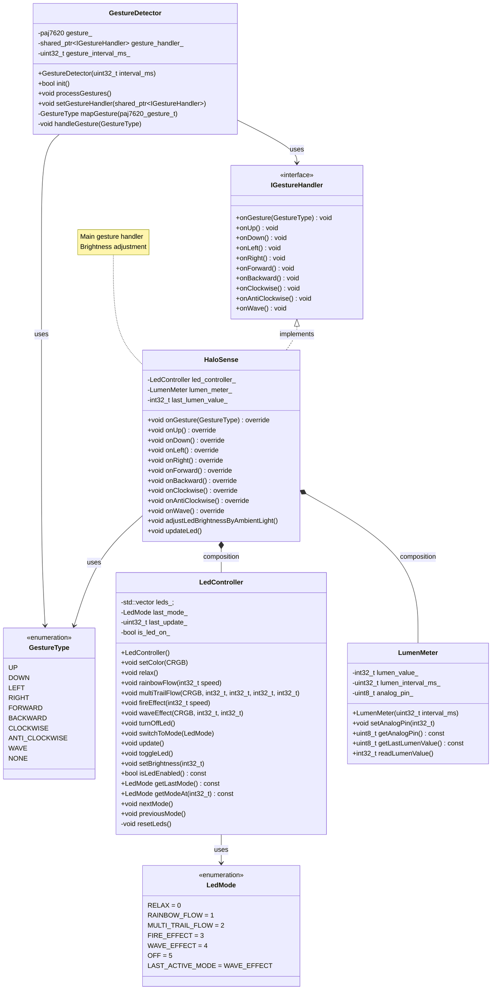

# Architecture

## Class Diagram



## Class detail

### GestureDetector

The `GestureDetector` class serves as a hardware abstraction layer for the PAJ7620U2 gesture sensor, providing non-blocking gesture recognition and event distribution to application handlers.

#### Responsibilities

1. **Hardware Abstraction**
   - Manages I2C communication with PAJ7620U2 sensor
2. **Gesture Mapping**
   - Converts hardware-specific values to application-specific `GestureType` enum
3. **Event Distribution**
   - Implements Strategy Pattern for gesture handler notification
4. **Timing Control**
   - Provides configurable interval-based non-blocking processing

#### Key Design Features

##### Non-blocking Architecture

- Calculate the difference between the current time and the last processing time, and execute gesture processing only if it exceeds the specified interval
  - This allows the main loop to remain responsive and handle other tasks concurrently
- Early return patterns for efficient processing

##### Event Distribution Strategy

The class implements a dual-dispatch pattern:

1. **Generic Handler**: `onGesture(GestureType)` for universal processing
2. **Specific Handlers**: Individual methods (`onUp()`, `onDown()`, etc.) for specialized handling

This approach allows handlers to choose their preferred level of granularity for gesture processing.

##### Dependency Injection

The HaloSense project uses Dependency Injection (DI) pattern to achieve loose coupling between components.

```cpp
class GestureDetector {
private:
    std::shared_ptr<IGestureHandler> gesture_handler_;  // Injected dependency
    
public:
    void setGestureHandler(std::shared_ptr<IGestureHandler> handler) {
        gesture_handler_ = handler;  // DI execution point
    }
};
```

```cpp
// Configuration in main.cpp
void setup() {
    auto handler = std::make_shared<HaloSense>();      // Create concrete implementation
    gesture_detector.setGestureHandler(handler);        // Inject dependency
}
```

### LedController

The `LedController` class manages WS2812B LED strip control and visual effects, providing non-blocking LED updates and state management for LEDs with 6 different effect modes.

#### Responsibilities

1. **Hardware Control**
   - Manages WS2812B LED strip communication via FastLED library
2. **Effect Management**
   - Implements 6 visual effect modes (RELAX, RAINBOW_FLOW, MULTI_TRAIL_FLOW, FIRE_EFFECT, WAVE_EFFECT, OFF)
3. **State Management**
   - Centralized LED on/off state and mode switching logic
4. **Non-blocking Updates**
   - Provides 50ms interval-based updates without blocking main loop

#### Key Design Features

##### Non-blocking Architecture

- Same with `GestureDetector`, uses the difference between the current time and the last processing time to ensure LED updates do not block the main loop

##### Mode Management

- **O(1) Mode Switching**
  - Enum-based automatic calculation using `LAST_ACTIVE_MODE`
- **Cyclic Navigation**
  - `getModeAt()` provides wrapping previous/next mode logic
- **State Preservation**
  - Mode switching preserves LED state and immediately triggers updates

### LumenMeter

The `LumenMeter` class handles ambient light sensing through analog input, providing throttled light value readings for LED brightness adjustment.

#### Responsibilities

1. **Analog Input Reading**
   - Reads ambient light values from analog pin (default A0)
2. **Value Caching**
   - Caches last reading to avoid redundant analog operations
3. **Brightness Mapping**
   - Provides raw analog values for brightness calculation in application layer

#### Key Design Features

##### Non-blocking Architecture

- Same with `GestureDetector`, uses the difference between the current time and the last processing time to ensure LED updates do not block the main loop
